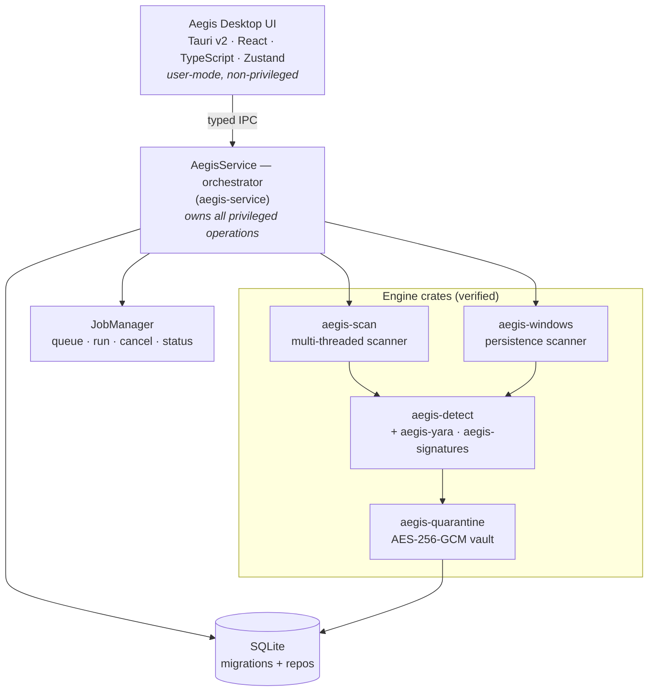

<h1 align="center">🛡️ Aegis Antivirus</h1>

<p align="center">
  <em>An open-source, Rust-powered antivirus and persistence scanner for Windows 10/11.</em>
</p>

<p align="center">
  <a href="https://github.com/rounak1434/aegis-antivirus/actions/workflows/ci.yml"></a>
  
  <a href="https://github.com/rounak1434/aegis-antivirus/releases"></a>
  <a href="LICENSE"></a>
</p>

<p align="center">
  
  
  
  
</p>

---

## Description

**Aegis** is a native Windows desktop antivirus built on a clean,
privilege-separated architecture: a Tauri + React UI talks over a typed IPC
boundary to a Rust engine that owns all scanning, detection, quarantine, and
(planned) real-time protection. Every detection is **explainable** — scores are
built from typed evidence, never a black box.

> ⚠️ **Aegis is a work in progress and is not a substitute for a maintained,
> production antivirus.** See the [Security Notice](#security-notice).

## Features

- **Multi-threaded file scanner** — recursive traversal, hidden/symlink handling,
  SHA-256 + MD5 hashing, live throughput/ETA metrics (Rayon).
- **Layered detection engine** — hash signatures + YARA-X rules + heuristics
  (entropy/packing, double & suspicious extensions, script & PowerShell-abuse
  indicators) with an additive 0–100 risk score and Safe→Critical levels.
- **Encrypted quarantine vault** — AES-256-GCM at rest, randomized blobs,
  SHA-256 integrity-checked restore, path-traversal guards, full audit trail.
- **Windows persistence scanner** — startup folders, registry Run/RunOnce,
  scheduled tasks, services, drivers, browser extensions, and the hosts file.
- **Explainable findings** — every detection carries human-readable evidence.

## Current Status

Backend engines are implemented and verified (tests + clippy + benchmarks); the
React UI is mid-migration from the design prototype.

| Milestone | Status |
|-----------|--------|
| ✅ Phase 1 — Foundation (workspace, DB, IPC, service skeleton) | Verified |
| ✅ Phase 2 — Scanner Engine (`aegis-scan`) | Verified |
| ✅ Phase 3 — Detection Engine (`aegis-detect`, `aegis-yara`, `aegis-signatures`) | Verified |
| ✅ Phase 4 — Quarantine System (`aegis-quarantine`) | Verified |
| ✅ Phase 5 — Windows Security Scanner (`aegis-windows`) | Verified |
| ✅ Phase 6 — Service Integration (`aegis-service` orchestrator) | Verified |
| 🚧 UI migration (prototype → React) | In progress |
| ⏳ Real-time protection, reporting, updater, packaging | Planned |

**Verified milestones:** Phase 1 ✅ · Phase 2 ✅ · Phase 3 ✅ · Phase 4 ✅ ·
Phase 5 ✅ · Phase 6 ✅

See [`ROADMAP_PUBLIC.md`](ROADMAP_PUBLIC.md), [`ROADMAP.md`](ROADMAP.md), and
[`TASKS.md`](TASKS.md) for detail.

## Architecture Overview

Privilege-separated: a non-privileged Tauri/React UI talks over a typed IPC
boundary to the Rust `AegisService` orchestrator, which is the *only* path to the
engine crates and the SQLite store.



Full design: [`ARCHITECTURE.md`](ARCHITECTURE.md),
[`SERVICE_INTEGRATION.md`](SERVICE_INTEGRATION.md),
[`DETECTION_ENGINE.md`](DETECTION_ENGINE.md),
[`QUARANTINE_SYSTEM.md`](QUARANTINE_SYSTEM.md),
[`WINDOWS_SCANNER.md`](WINDOWS_SCANNER.md).

## Technology Stack

| Layer | Tech |
|-------|------|
| Backend | Rust, Tokio, Rayon, SQLite (rusqlite), Serde |
| Detection | YARA-X, SHA-256/MD5, custom heuristics |
| Crypto | AES-256-GCM (quarantine vault) |
| Frontend | Tauri v2, React 18, TypeScript, Tailwind CSS, Zustand |
| Platform | Windows 10 / 11 (MSVC toolchain) |

## Project Structure

```text
aegis-antivirus/
├── crates/
│   ├── aegis-common/        # shared domain types
│   ├── aegis-ipc/           # IPC request/response/event contracts
│   ├── aegis-db/            # SQLite migrations + connection
│   ├── aegis-scan/          # multi-threaded file scanner
│   ├── aegis-signatures/    # SHA-256/MD5 signature database
│   ├── aegis-yara/          # YARA-X rule manager
│   ├── aegis-detect/        # detection engine + threat model
│   ├── aegis-quarantine/    # AES-256-GCM encrypted vault
│   ├── aegis-windows/       # Windows persistence scanner
│   ├── aegis-service/       # Windows service runtime
│   └── aegis-update/        # update metadata (planned)
├── src/                     # React + TypeScript UI
├── src-tauri/               # Tauri app shell
├── migrations/              # SQLite schema migrations
├── design-prototype/        # source-of-truth UI prototype
└── *.md                     # architecture & phase docs
```

## Screenshots

The UI follows the design prototype in [`design-prototype/`](design-prototype/).
Screenshot inventory + capture instructions: [`SCREENSHOTS.md`](SCREENSHOTS.md);
images live under [`docs/screenshots/`](docs/screenshots/).

| Dashboard | Scan Center | Threat Center |
|-----------|-------------|---------------|
|  |  |  |
| **Quarantine** | **Real-Time Protection** | **Settings** |
|  |  |  |

> _Image files are placeholders until the React UI migration completes — see
> [`SCREENSHOTS.md`](SCREENSHOTS.md) to capture them._

## Development Setup

**Prerequisites**

- Rust stable (1.96+) with the **MSVC** toolchain
- Visual Studio Build Tools — *Desktop development with C++* workload
- Node.js 20+ and npm
- WebView2 runtime (ships with Windows 11)

See [`DEVELOPMENT.md`](DEVELOPMENT.md) for the full toolchain notes.

## Build Instructions

```bash
# Backend — build & test the Rust workspace
cargo build --workspace
cargo test --workspace --exclude aegis-tauri

# Lint (deny warnings)
cargo clippy --workspace --exclude aegis-tauri --all-targets --all-features -- -D warnings

# Frontend
npm install
npm run build

# Run the desktop app (dev)
npm run tauri dev
```

## Installation (packaged)

Aegis builds to **MSI**, **NSIS** (`-setup.exe`), and a portable **ZIP**, and
registers the **AegisService** Windows service (auto-start + crash recovery).

```powershell
deploy\build-installers.ps1          # build MSI + NSIS + portable ZIP
```

Install/upgrade/uninstall, silent install, data layout, and service control:
see [`INSTALLATION.md`](INSTALLATION.md) and [`DEPLOYMENT.md`](DEPLOYMENT.md).

Releases ship `SHA256SUMS`, a CycloneDX **SBOM**, and (optionally) Authenticode +
checksum signatures. Build/sign/checksum/SBOM flow:
[`RELEASE_ENGINEERING.md`](RELEASE_ENGINEERING.md),
[`CODE_SIGNING.md`](CODE_SIGNING.md), [`SBOM.md`](SBOM.md). Verify a download:

```powershell
deploy\verify-release.ps1 -Dir .\dist   # checksums + signatures
```

## Roadmap

Planned next: UI migration completion, real-time protection (file/process
monitoring), reporting (JSON/HTML/PDF), signature/rule updater, and Windows
packaging + code signing. Full plan in [`ROADMAP.md`](ROADMAP.md).

## Security Notice

Aegis is **experimental software under active development**. Do **not** rely on
it as your sole protection on a production machine. Test fixtures synthesize
benign malware-like markers (e.g. EICAR-style strings) at runtime — no real
malware is stored in this repository. The quarantine vault encrypts isolated
files with AES-256-GCM; see [`QUARANTINE_SYSTEM.md`](QUARANTINE_SYSTEM.md) for
its key-management limitations. To report a vulnerability, see
[`SECURITY.md`](SECURITY.md).

## Contributing

Contributions are welcome — see [`CONTRIBUTING.md`](CONTRIBUTING.md) for setup,
coding standards, testing requirements, and PR guidelines.

## License

Licensed under the **Apache License 2.0** — see [`LICENSE`](LICENSE).
